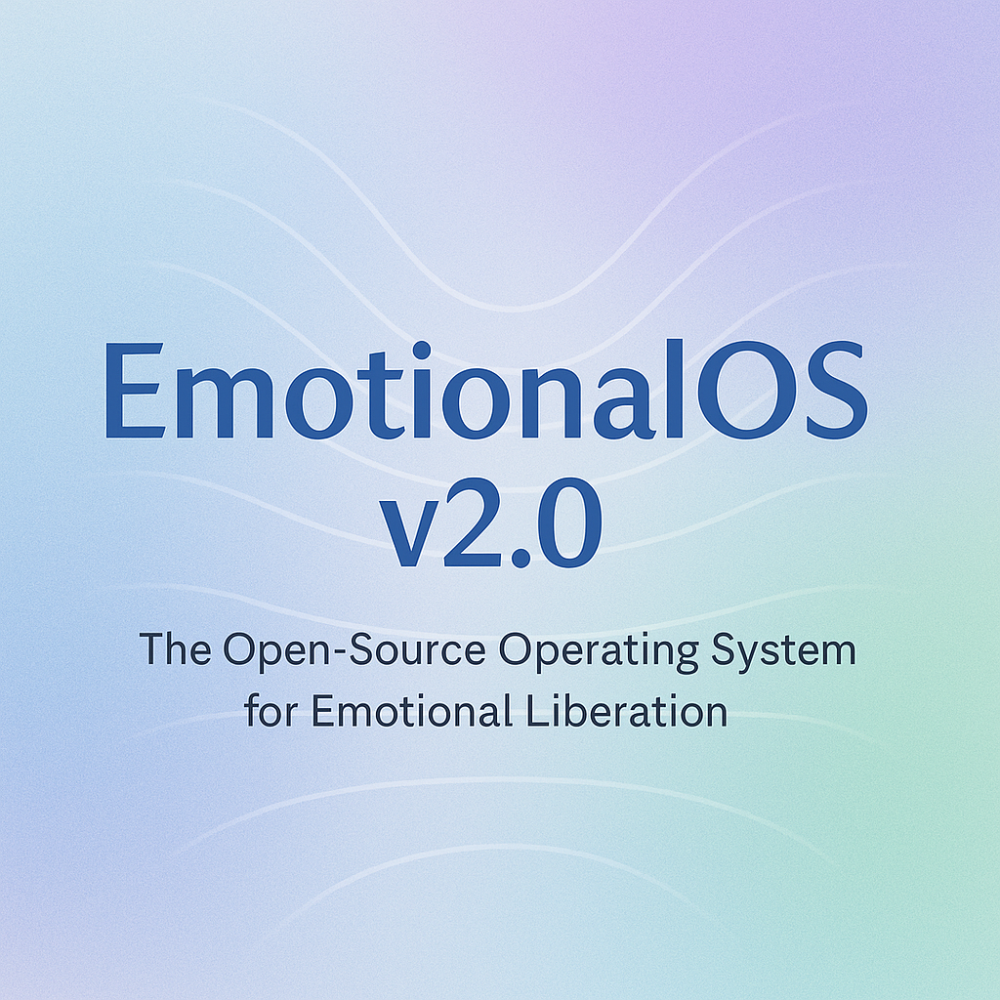

# 🌎 EmotionalOS



> **The open-source operating system for emotional liberation.**

---

## 🧠 What is EmotionalOS?
**EmotionalOS** is a philosophical and emotional framework for living a radically authentic, emotionally free life.  
It’s not software for your device — it’s a restoration for your heart.

- 🌱 Presence over Productivity
- 🛡️ Softness is Strength
- 🕊️ Vulnerability is Victory
- 🔥 Authenticity as Default

Version 2.0 launches the first full emotional operating framework, ready for open collaboration.

---

## 📚 Explore the Wiki

> 📖 [Explore the EmotionalOS Wiki ➔](Wiki/Landing-Page.md)

**Inside the Wiki:**
- Getting Started
- Core Philosophy
- Emotional Kernel Architecture
- Emotional HOW-TO Guides
- Contribution Guide
- Roadmap
- FAQ

---

## 🚀 How to Install EmotionalOS

> You don’t install it on a computer.  
> You install it inside yourself.

**Installation Process:**
1. Read the [How-To Guides](Wiki/How-To-Guides.md)
2. Reflect on your emotional default settings
3. Practice small emotional updates daily
4. Share your evolving emotional presence
5. Repeat. Healing is nonlinear.

🛠️ **No reboot required. Updates happen live.**

---

## 🔥 Why EmotionalOS?

Because the world wasn't built for emotional safety.  
Because vulnerability is revolutionary.  
Because softness is strength.  
Because authenticity was always the way forward.

---

## 📜 License

> 

EmotionalOS is released under the **MIT License** — forever free to use, remix, and extend.  
If you can feel, you can fork it. ❤️

---

## 🏷️ Badges

```markdown


![Revolutionary Software](https://img.shields.io/badge/Revolutionary-Software-0984e3
